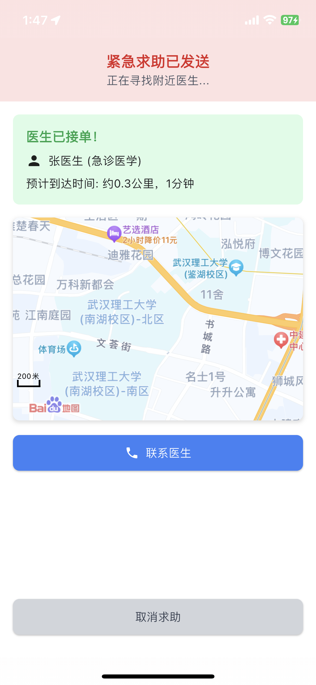

<h1 align="center" style="margin: 30px 0 30px; font-weight: bold;">医邻救援 V1.0</h1>
<h4 align="center">基于 ruoyi flutter 框架</h4>

# quick start
```
cd ios
pod install
flutter run
```

如果你的项目无法构建，请尝试下面的命令清空缓存和构建包并重试：
```
flutter clean
flutter pub get
cd ios
rm -rf Pods, Podfile
pod install
```

## 简介
1. 愿景  
    充分利用空闲的医疗资源，有效的在黄金时间救助危急病人  

2. 功能  
    根据症状同城精确匹配  
    摇一摇快速匹配  
    紧急问题点按按钮快速匹配  
    ｜ 类似于apple的紧急呼叫  

3. 需要实现  
    根据目前设备地址快速匹配附近注册的医生身份用户  
    订单系统  
    ｜ 有偿增值服务  
    医生资质审核  


## 演示截图&视频
https://github.com/user-attachments/assets/7ec944a3-63a0-43db-9b24-887cbb1a6d71

<table>
    <tr>
        <td></td>
        <td></td>
        <td></td>
    </tr>
    <tr>
        <td></td>
        <td></td>
        <td></td>
    </tr>
     <tr>
        <td></td>
    </tr>
</table>
